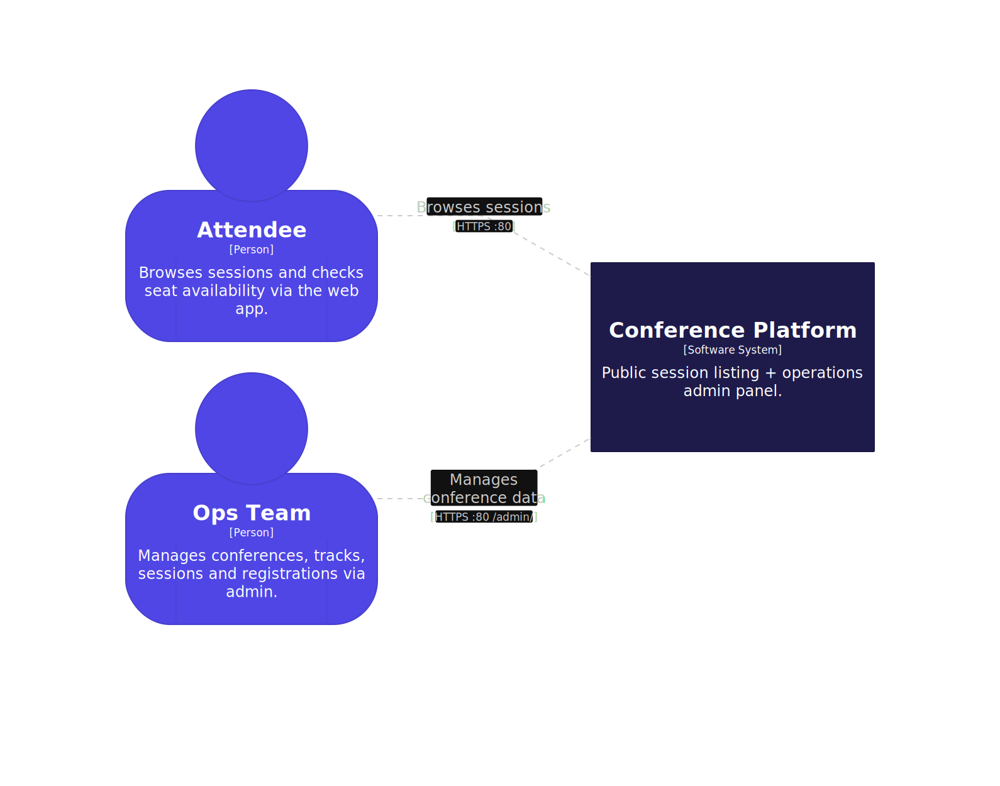
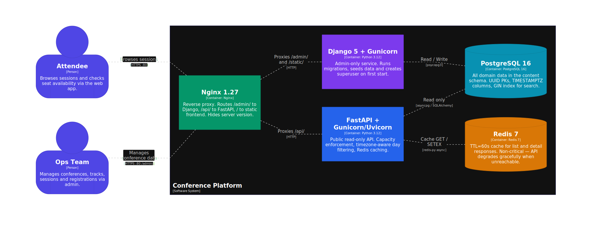
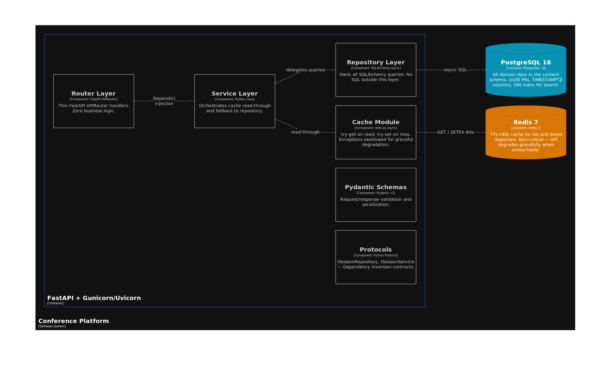
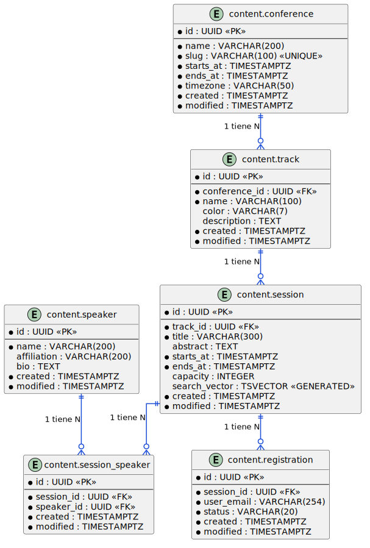
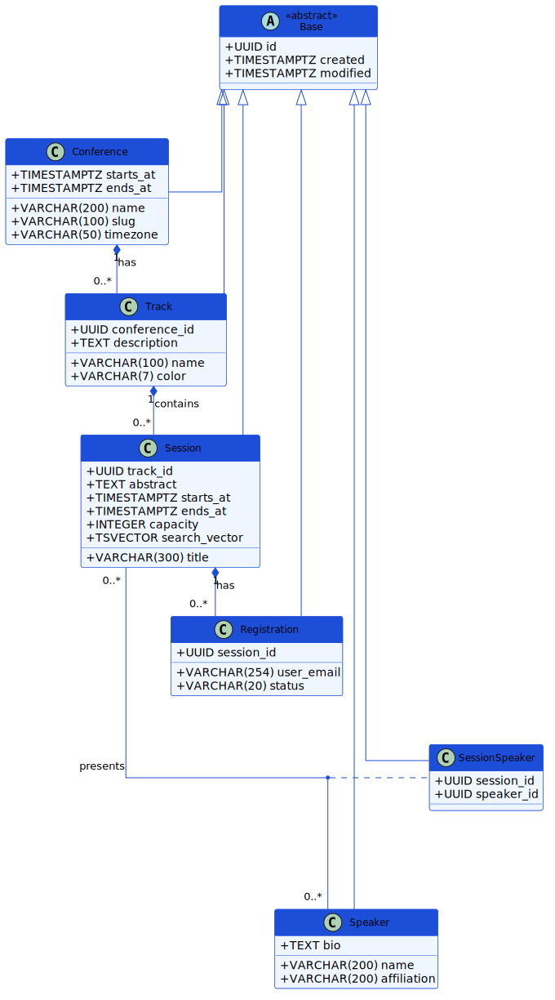

# Conference Backend

Mi tema es: **Opción B: Sesiones de Conferencia y Registros**.

---

## Cómo ejecutar

Solo necesitas Docker instalado.

```bash
git clone <repo-url>
cd evaluacion-backend
cp .env.example .env
docker compose up --build
```

Después de unos 30 segundos todo debería estar funcionando. Se puede verificar abriendo estas URLs:

| URL | Qué deberías ver |
|-----|-----------------|
| http://localhost/admin/ | Pantalla de login del admin de Django |
| http://localhost/api/v1/sessions/ | Lista de sesiones en JSON |
| http://localhost/api/openapi.json | Documentación de la API |
| http://localhost/ | Frontend de la conferencia |
| http://localhost/apiaaaaaa | Página de error 404 |
| http://localhost/api/v1/healthz | `{"status":"ok","checks":{"postgres":"ok","redis":"ok"}}` |

Al iniciar por primera vez se crean automáticamente:
- Un usuario administrador con las credenciales del `.env`
- 300 sesiones y 150 000 registros de prueba

---

## Cómo ejecutar las pruebas

Las pruebas necesitan que Postgres esté corriendo porque son pruebas de integración:

```bash
docker compose up -d postgres
pytest
```

Para ejecutar solo las pruebas de un servicio:

```bash
pytest django_admin/conference/tests.py -v   # pruebas de Django (9 pruebas)
pytest fastapi/tests/test_fastapi.py -v      # pruebas de FastAPI (6 pruebas)
```

**Probar que Redis puede fallar sin romper la API:**

```bash
docker compose stop redis
curl http://localhost/api/v1/sessions/
```

La API debe seguir devolgiendo datos de Postgres. El endpoint `/healthz` mostrará `"redis":"unavailable"` pero el status seguirá siendo `200`.

---

## Arquitectura del sistema

El sistema tiene 5 contenedores que se comunican entre sí:

- **Nginx** recibe todas las peticiones del exterior y las enruta: `/admin/` va a Django, `/api/` va a FastAPI, y `/` sirve el frontend estático.
- **Django + Gunicorn** expone solo el panel de administración. Es el único servicio que escribe en la base de datos.
- **FastAPI + Gunicorn/Uvicorn** es la API pública de solo lectura. Consulta Postgres directamente (sin pasar por Django) y usa Redis como caché.
- **PostgreSQL** guarda todos los datos del dominio en el esquema `content`.
- **Redis** guarda en caché las respuestas de la API por 60 segundos para que las páginas carguen más rápido.

### C4 — Contexto del sistema



### C4 — Contenedores



### C4 — Componentes internos de FastAPI



---

## Cómo interactúan los módulos

### Flujo de una petición a la API pública

1. El navegador hace `GET /api/v1/sessions/`
2. **Nginx** recibe la petición y la reenvía al contenedor FastAPI
3. El **Router** (`sessions.py`) recibe la petición y llama al servicio
4. El **Service** (`SessionService`) primero intenta leer la respuesta desde **Redis**
5. Si hay caché → devuelve la respuesta directo, sin tocar Postgres
6. Si no hay caché → llama al **Repository** (`SessionRepository`)
7. El **Repository** ejecuta la consulta SQL en **Postgres** y devuelve los datos
8. El **Service** guarda el resultado en Redis (TTL 60 s) y lo devuelve al router
9. El **Router** serializa la respuesta con los **Schemas de Pydantic** y la envía al navegador

### Flujo cuando el admin crea una sesión

1. El admin de operaciones abre `http://localhost/admin/`
2. **Nginx** reenvía la petición a **Django**
3. **Django** escribe directamente en **Postgres**
4. La caché de FastAPI en Redis sigue teniendo el dato viejo hasta que venza el TTL (máximo 60 s)

---

## Diseño de base de datos

### Diagrama ER



### Diagrama UML de Clases



DDL completo: [`schema.sql`](./schema.sql)

---

## Decisiones de diseño

### Esquema `content` en Postgres
Todas las tablas del dominio viven en el esquema `content`, no en `public`. Esto separa las tablas de la aplicación de las tablas internas de Django y hace más limpio el diseño.

### Caché
Usé TTL (tiempo de expiración) de 60 segundos. Cuando FastAPI recibe una petición, primero busca en Redis. Si no está (cache miss) consulta Postgres, guarda el resultado en Redis con `SETEX 60`, y responde. Lo malo es que la caché puede quedar desactualizada hasta 60 s después de que el admin cambie algo en Django.

---

## Lógica de negocio implementada

### 1. Control de capacidad (Inventory/Capacity Enforcement)

Cuando la API devuelve una sesión, incluye tanto `capacity` como `registered` (registros confirmados actuales). Con esto el frontend puede calcular los asientos disponibles.

El campo `registered` se calcula con esta subconsulta correlacionada en SQLAlchemy:

```python
registered: Mapped[int] = column_property(
    select(func.count(RegistrationModel.id))
    .where(
        RegistrationModel.session_id == id,
        RegistrationModel.status == "confirmed",
    )
    .correlate_except(RegistrationModel)
    .scalar_subquery()
)
```

**Por qué no hay condición de carrera:** En este caso no existe porque:
— La subconsulta se ejecuta dentro de la misma transacción de lectura de Postgres, por lo que siempre devuelve un número consistente.
- Las **escrituras** (crear o cancelar registros) solo ocurren a través del admin de Django, que es de un solo usuario a la vez. No hay un endpoint de la API       pública que registre usuarios, así que no hay dos usuarios tratando de registrarse a la vez

### 2. Filtrado por ventana de tiempo con zona horaria

El endpoint acepta un parámetro `day` (fecha) y `tz` (zona horaria):

```
GET /api/v1/sessions/?day=2026-07-01&tz=America/New_York
```

El filtro usa la función `timezone()` de Postgres para convertir la fecha almacenada (que siempre está en UTC) a la zona horaria del usuario antes de comparar:

```sql
CAST(timezone('America/New_York', starts_at) AS DATE) = '2026-07-01'
```

Esto significa que una sesión que empieza a las 02:00 UTC del 1 de julio, aparece el 30 de junio si el usuario está en Nueva York (UTC-4). Por defecto la zona horaria es UTC.

---

## Principios SOLID aplicados:

**Single Responsibility:** Cada clase tiene una sola responsabilidad. Los routers solo reciben peticiones y responden. Los servicios orquestan la lógica. Los repositorios ejecutan las consultas SQL. Los schemas validan y serializan.

**Open/Closed:** Las clases concretas implementan interfaces (Protocols) sin modificar el código existente. Para agregar un nuevo repositorio basta con implementar `ISessionRepository`.

**Liskov Substitution:** `SessionRepository` implementa `ISessionRepository` como Protocol, así que se puede reemplazar por cualquier otra implementación (por ejemplo, una fake para tests) sin que el servicio se entere.

**Interface Segregation:** Hay interfaces separadas para `ISessionRepository`, `ITrackRepository`, `ISessionService` e `ITrackService`. Ninguna clase implementa métodos que no necesita.

**Dependency Inversion:** Los servicios reciben el repositorio y el cliente de Redis por constructor (inyección de dependencias vía `Depends()` de FastAPI), no los crean ellos mismos. Así dependen de abstracciones, no de implementaciones concretas.

---

## Compromisos que tomé (Trade-offs)

| Decisión | Por qué lo hice así | Desventaja |
|----------|-------------------|------------|
| Búsqueda con ILIKE | Simple, sin infraestructura extra | Lento en tablas con millones de filas |
| Caché solo por TTL | Fácil de implementar y entender | Los datos pueden estar desactualizados hasta 60 s |
| Subconsulta para `registered` | Siempre correcta, sin lógica extra | En altísimo tráfico sería más rápido un contador en BD |
| Paginación por offset | Lo esperaba el frontend, fácil de implementar | Puede mostrar duplicados con inserciones concurrentes |
| Solo pruebas de integración | Prueban el comportamiento real del sistema | Necesitan Postgres activo para correr |

---

## Qué haría diferente con más tiempo

1. **Invalidación de caché al guardar en el admin.** Ahora la caché vence sola cada 60 segundos. Con más tiempo usaria `post_save` y `post_delete` de Django para que cuando el admin guarda un cambio, se borre inmediatamente la clave de Redis afectada. Así los datos estarían siempre actualizados.

2. **Seed más rápido.** El comando de seed crea 150 000 registros al iniciar el contenedor, lo que tarda unos segundos. Con más tiempo investigaria como hacerlo mas rapido.

---

## Objetivo de rendimiento

El endpoint de listado de sesiones responda en menos de 100 ms.

| Situación | Tiempo estimado | Por qué |
|-----------|----------------|---------|
| Con caché (Redis hit) | 5–20 ms | Solo es un GET a Redis y deserializar el JSON |
| Sin caché (consulta a BD) | 50–150 ms | Una consulta async a Postgres con joins |
| Archivos estáticos (CSS, JS) | 1–5 ms | Nginx los sirve directo, sin pasar por Python |


# Endpoints defensa

Me toco el B3

## Endpoint GET /api/v1/speakers/{id}

Primero cree un nuevo archivo llamado speakers.py en api/v1/ defini como ruta "speakers"
y cree la funcion get_speaker_detail que llama a speaker_service y retorna su respuesta, caso contrario indica que no se ha encontrado el speaker

En service esta la logica de negocio en la funcion get_speaker, primeramente a igual que sessiones obtengo cache_key y cache_data para posterioramente verificar si ya se encuentra en cache.
Caso contrario llamo al repositorio de postgres speaker_repository.

Como se me pidio devolver  las siguientes sessiones **next_sessions** pero tambien el conteo de las sessiones pasadas **past_sessions_count**, decidi hacer un for que recorre las sessiones, si las sessiones son el futuro lo agrego a la lista de nxt_sessions si son en el pasado lo agrego al contador de sessiones pasadas 

al final lo ordeno  porque se me pidio que esten ordenasas por **start_at** ascendente y lo envio el resultado.

Tambien en repository agregue la consulta get_speaker_by_id es simple solo selecciono el speaker que tenga el mismo id

Una cosa importante fue modificar speaker_schema solo tuve que agregar los contratos de respuesta de mi API.

finalmente cree los providers fue bastante facil porque son siempre iguales, creo que se podria mejorar usando alguna abstraccion.

- Que me falto:
Se podria optimizar bastante, pero no soy muy bueno con SQLAlchemy asi que decidi hacerlo con for en vez de usar mucho su ORM

----

## Endpoint GET /api/v1/speakers/?has_upcoming=true

Fue mas facil solo tuve que hacer primero hice tambien su api en  speakers, igual que en el anterior caso, hacer una consulta para obtener los speakers con al menos una sesion futura, hice su respectivo servicio mas corto y su provider

- Que me falto
Creo que en este caso nada, capaz revisar mas a fondo si tiene errores

