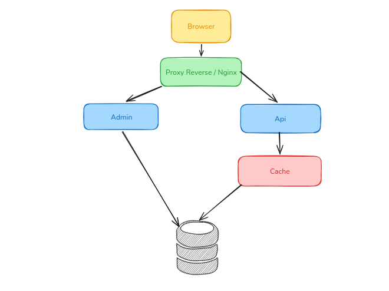
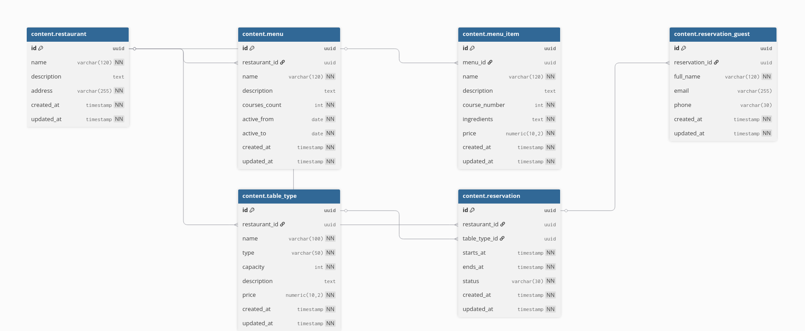
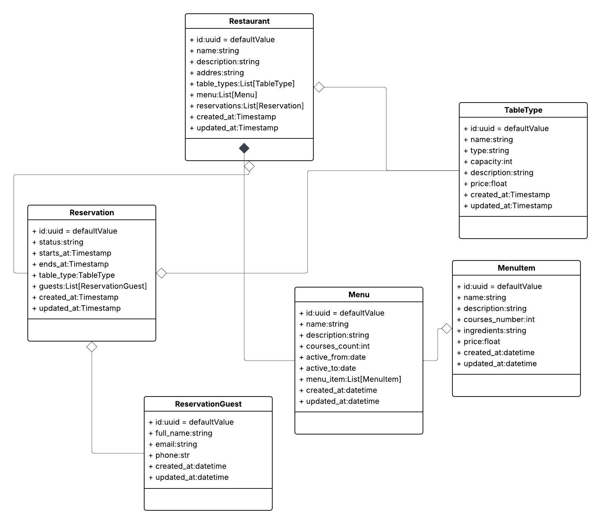
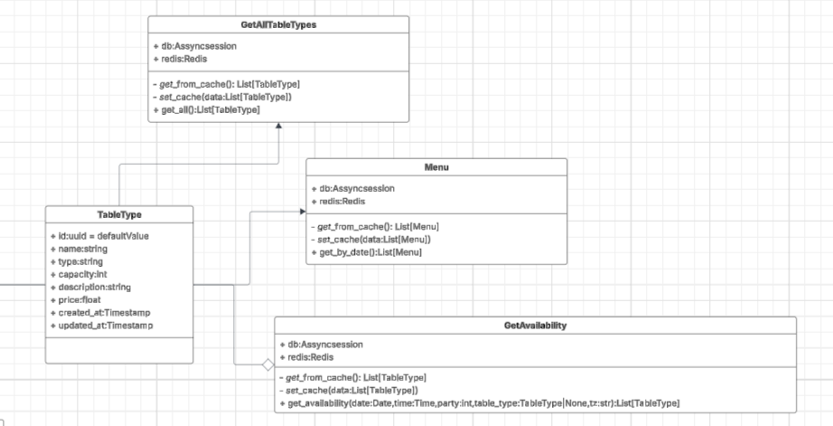

# Evaluacion-backend
## Escenario escogido: Restaurante
### Como correr / ejecutar el proyecto
1.- Renombrar el archivo `.env_template` a `.env`


2.- Rellenar las variables de entorno, si no las sabe, consultar al creador.


3.- Ejecutar el comando 
``` bash 
docker compose up -d --build 
```


4.- Rutas de interes

`http://localhost:80/admin` --> Administrador de django.


`http://localhost:80/` --> Frontend.


`http://localhost:80/api/v1/healthz` --> Chequear salud de la api.


5.- Desiciones Técnicas

```bash
├── db-desing
│   └── restaurant-db.sql
├── docker-compose.yml
├── nginx
│   └── nginx.conf
├── pyproject.toml
├── README.md
├── src
│   ├── admin
│   ├── app_api
│   └── ui

```
5.1.- El diseño de la insfrastructura la app basado en los requerimientos que recibimos del Product Owner antes que se vaya de vacaciones, es el siguiente:




Contamos con un `frontend` básico, servido en un servidor web como `nginx` y a la misma vez este frontend consume la api desarrollada en `fastapi` para un deploy más rapido, esta api esta deployada en un servidor uvicorn para aprovechar las capacidades del asincronimos de `fastapi`, en el que se lo consume a través de un proxy reverse en nginx. Esta api solo se encargara de hacer consultas, nada de escrituras.

De la misma manera el modulo de `admin` esta desarrollado en `Django`, esto porque tal como los requerimientos especificaron **velocidad**, que mejor que un framework que nos ofrece todo un modulo de `Admin` a la distancia de un comando, de la misma manera, este modulo esta deployado en un servidor sincrono como WSGI - gunicorn, y servimos los archivos estaticos del modulo de `Admin` en el servidor nginx, y realizamos un proxy reverse hacia el servidor del modulo `Admin`. Este modulo se encargara de administrar toda la aplicación como tal, modificar registros, borrar, crud, etc.

De esta manera, tenemos los 2 modulos requeridos centralizados, y un proxy reverse que actua como escudo y podemos configurarlo de tal forma que las apis no esten expuestas al mundo exterior, y toda peticion pase por el escudo

Y todo esto esta en la DNS que docker nos permite usar, al momento de levantar los contenedores.

```nginx
server {
    listen 80;
    
    server_tokens off;

    location / {
        root /usr/share/nginx/html;
        index index.html;
        try_files $uri $uri/ /index.html;
    }
    location /static/ {
        alias /app/staticfiles/;
    }

    location /media/ {
        alias /app/media/;
    }
    location /api/v1/ {
        proxy_pass http://api:8000/api/v1/;
        proxy_set_header Host $host;
        proxy_set_header X-Real-IP $remote_addr;
        proxy_set_header X-Forwarded-For $proxy_add_x_forwarded_for;
    }
    location /admin/ {
        proxy_pass http://admin:8000/admin/;
        proxy_set_header Host $host;
        proxy_set_header X-Real-IP $remote_addr;
        proxy_set_header X-Forwarded-For $proxy_add_x_forwarded_for;
    }
   
}
```
5.1.1.- ¿Por qué el uso de Redis?


Usar Redis para cachear respuestas pesadas es una estrategia de optimización de latencia y escalabilidad. En el caso de tu base de datos de restaurante (especialmente con 400-500 registros y consultas complejas):

PostgreSQL, por muy rápido que sea, es una base de datos basada en disco (aunque use memoria caché). Cuando ejecutas una consulta, el motor debe:

    Analizar el plan de ejecución.

    Bloquear registros (si es necesario).

    Leer datos de las tablas/índices.

    Construir el resultado.

Redis vive exclusivamente en la RAM. Una respuesta "pesada" (como un reporte de todas las mesas reservadas con sus invitados y detalles del menú) puede tardar 200ms en SQL. En Redis, esa misma respuesta se recupera en menos de 1ms porque es simplemente una lectura de clave-valor.

Si la API recibe 100 visitas por segundo, tu base de datos estará ejecutando 100 veces la misma consulta compleja. Esto genera:

    Consumo de CPU: El servidor SQL se satura haciendo el mismo cálculo.

    Contención de I/O: El disco se vuelve el cuello de botella.

Al usar Redis, la API hace la consulta a SQL solo una vez (cuando la caché está vacía o expiró). Las 99 visitas restantes obtienen la respuesta desde la memoria de Redis, dejando a tu PostgreSQL libre para realizar operaciones críticas de escritura (como nuevas reservas).

5.1.2.- ¿Pero que hacemos si el modulo de `Admin` y la `API` recurren a la misma Base de Datos?
`Django` nos ofrece una buena solución, ya que si la API guardo en cache una consulta, y el Admin puede ser que modifique algunos registros de esa consulta, la API estara consultando registros no consistentes.

Para esto usamos `Signals`:

```python
from django.db.models.signals import post_save, post_delete
from django.dispatch import receiver
import redis
import os

r = redis.Redis(host=os.getenv("REDIS_HOST"), port=os.getenv("REDIS_PORT"))

from .models import TableType, MenuItem, Menu, Reservation

@receiver([post_save, post_delete], sender=TableType)
def invalidate_table_types(sender, **kwargs):
    r.delete("table_types:all")

@receiver([post_save, post_delete], sender=MenuItem)
@receiver([post_save, post_delete], sender=Menu)
def invalidate_menu(sender, **kwargs):
    for key in r.scan_iter("menu:*"):
        r.delete(key)

@receiver([post_save, post_delete], sender=Reservation)
def invalidate_availability(sender, **kwargs):
    for key in r.scan_iter("availability:*"):
        r.delete(key)
```


Los Signals (señales) de Django son una herramienta diseñada para permitir que diferentes partes de tu aplicación se comuniquen entre sí de forma desacoplada. Funcionan bajo el patrón Observer (observador): permiten que un emisor avise a uno o varios receptores cuando ocurre un evento específico.

En términos simples: "Cuando suceda A, ejecuta B", sin que la lógica de "A" tenga que saber nada sobre "B".

De esta manera, cada vez que el modulo Admin de Django ejecute un post o delete, las llaves asociadas a el cache, se borraran, y la API tendra que ir a la Base de Datos para consultar de nuevo.


5.2.- El diseño de la base de datos se encuentra en la carpeta `db-desing`, esta tambien cuenta con un script de inicialización de registros, apróximadamente 300-500 registros.



La base de datos fue diseñada siguiendo una estructura basada en los requerimientos La entidad `restaurant` actúa como núcleo principal del modelo, ya que representa cada restaurante y se relaciona con múltiples tipos de mesa (`table_type`), menús (`menu`) y reservas (`reservation`). Esta separación permite mantener la información organizada por restaurantes, evitando redundancia de datos y facilitando futuras ampliaciones del sistema. Las entidades `menu` y `menu_item` fueron divididas para representar correctamente la relación entre un menú y los distintos platos o cursos que lo componen, permitiendo manejar menús degustación de varios tiempos de manera flexible.

Por otro lado, la entidad `reservation` centraliza la información de las reservas realizadas, relacionándose tanto con el restaurante como con el tipo de mesa seleccionado. Esta entidad contiene los atributos `starts_at` y `ends_at` para controlar la duración de reserva. A su vez, `reservation_guest` permite asociar múltiples invitados a una misma reserva, representando una relación uno a muchos necesaria para modelar reservas grupales. Además, las tablas incluyen restricciones, validaciones e índices para garantizar integridad de datos, consistencia y un mejor rendimiento en consultas frecuentes, especialmente en operaciones relacionadas con disponibilidad, horarios y gestión de reservas. 


Se le añadieron los indices para optimizar las peticiones de `disponibilidad`:
Por ejemplo, idx_reservation_time mejora el rendimiento de consultas relacionadas con fechas y horarios de reservas, mientras que idx_reservation_status acelera filtros por estado como reservas confirmadas, pendientes o canceladas. Estos índices permiten que PostgreSQL encuentre la información de manera más eficiente sin recorrer completamente las tablas.
También se crearon índices sobre claves foráneas como restaurant_id, menu_id y reservation_id, utilizados en relaciones uno a muchos entre entidades como restaurantes, menús, mesas y reservas. Esto optimiza operaciones comunes del sistema, como cargar los tipos de mesa de un restaurante, obtener los platos de un menú o listar los invitados de una reserva, mejorando considerablemente el rendimiento general de la aplicación.


5.3 .- Modelado de Entidades del Negocio





Las cosas buenas, es un modelo orientado a la base de datos, es un representacion de la base de datos, y esto puede ser contraproducente, pero ya que el Product Owner especifico velocidad y deploy, es necesario usar ORMs para hacerlo rápido.

La entidad Restaurant actúa como un nodo central que organiza de forma jerárquica y lógica los menús y la gestión de disponibilidad mediante tipos de mesa. La separación inteligente entre Reservation y ReservationGuest permite una gran flexibilidad para manejar grupos, mientras que la relación entre Menu y MenuItem ofrece una versatilidad excelente para gestionar ofertas temporales o menús especializados sin duplicar datos innecesarios. 


Las cosas malas, se pueden separar más las responsabilidades, hacer una entidad User tal vez, y más cosas.





Luego aqui podemos ver le diseño de los Services es la clave para que la app no se vuelva un caos:

- Desacoplamiento total: Al inyectar db (la sesión asíncrona) y redis dentro de cada servicio, se logra que la lógica de negocio no tenga ni idea de cómo se conectan las cosas, solo sabe qué pedir. Si el día de mañana quieres cambiar la forma en que se conecta a Redis o migrar de DB, solo tocas el servicio, no toda la API.

- Centralización del "Cache-Aside": Los métodos - get_from_cache y - set_cache. Eso es vital. Se encapsula el ruido de Redis (serializar, guardar, expirar) dentro de la clase. El controller no se tiene que enterar de que existe Redis; el controller simplemente llama a get_all() y el servicio se encarga de decidir si sirve el dato fresco de SQL o el rápido de caché.

- Separación de responsabilidades: Esta GetAllTableTypes, Menu y GetAvailability como clases distintas. Eso está de lujo porque cada una tiene una única responsabilidad. GetAvailability es, por lejos, la más compleja (por los argumentos que recibe: date, time, party, etc.), y al tenerla aislada en su propia clase, se puede testear esa lógica matemática de disponibilidad sin que estorbe el resto de la app.


Lo malo obviamente es que, algunos servicios son muy grandes, podemos seguir separando responsabilidades, hacerlos mas pequeños, podemos seguir escalando, tal vez pensar en otro arquitectura, tal vez un patrón CQRS, y manejar diferentes bases de datos para consulta y escritura, para el modulo de Admin y la API, de esta manera podriamos aprovechar las ventajas de cada uno. Otros patrones como Repository Pattern, para el acceso a la base de datos, si se fijan, hay metodos repetidos en cada servicio `get_from_cache,set_cache` incumplimos el metodo DRY, tambien el cuello de botella que hay en la consulta `get_availability` es el más propenso a fallar, tal vez con un Bloqueo Optimista, cuando el tráfico suba se podra ver las carencias, pero bueno, eso es lo que pude hacer en un dia. 


**Enjoy exploring the code!**